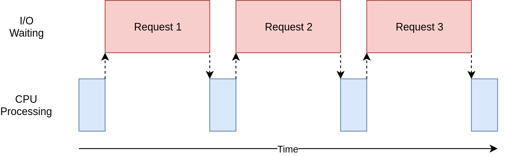
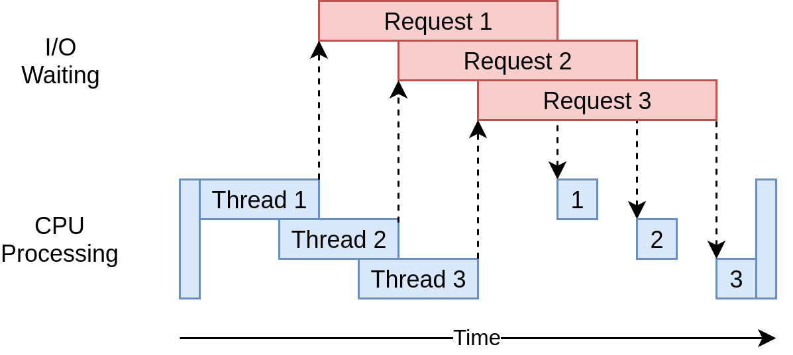
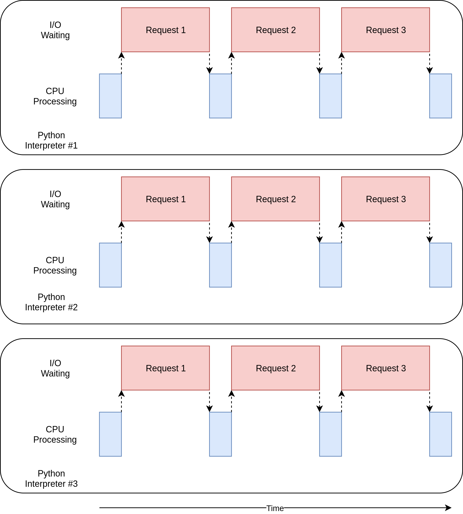

# Concurrency_project_python_Uady
Spanish ---------------------------------------------

(synchronous) Multitarea cooperativa  	1CPU
Las tareas deciden cuándo ceder el control. 

(threading) Multitarea preventiva  	1cpu
El sistema operativo decide cuándo cambiar tareas externas a Python. 

(multiprocessing) Multiprocesamiento  Muchos CPU
Todos los procesos se ejecutan al mismo tiempo en diferentes procesadores.

English----------------------------------------------

(synchronous) Cooperative multitasking  	1 CPU
The tasks decide when to give up control.

(threading) Pre-emptive multitasking   1 CPU
The operating system decides when to switch tasks external to Python. 

(multiprocessing) Multiprocessing 	Many CPU
The processes all run at the same time on different processors. 

